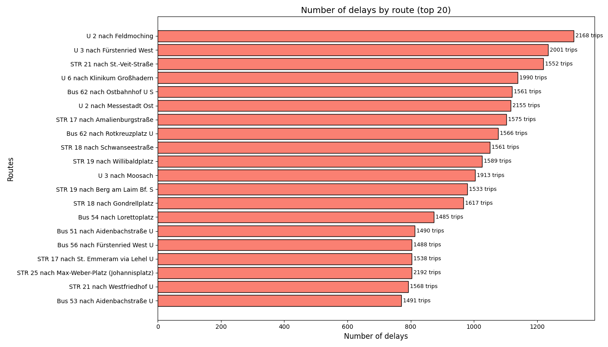
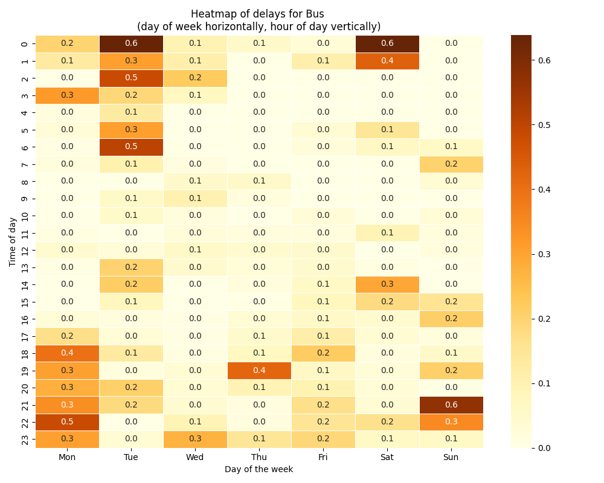

# Deutsche Bahn (DB) Delay Analysis in Munich

This project focuses on collecting, cleaning, and analyzing data about delays and cancellations in Deutsche Bahn (DB) public transport in the greater Munich area. My main goal is to understand how frequently delays occur, which routes are most prone to them, and how likely cancellations are.

## Data Collection

- The DB API provides delay data only for the most recent 15 minutes; afterward, the data is removed. Additionally, there is a limit on how much can be retrieved at once.
- To build a complete dataset, a script was developed to automatically query and save delay information every 15 minutes, structuring the data throughout each day for a total period of 9 days.
- This script was continuously run on **AWS EC2**, where it collected data regularly and stored it for further analysis.

> **Running data collection on AWS:**  
> Simply start the `data_collection_script.py` on an EC2 instance.  
> The `Procfile.windows` and `requirements.txt` files required for this setup are included in the repository.

## Data Structure and Filtering

1. **Excluding Routes with Few Observed Trips**  
   - Routes that appeared very rarely during data collection were excluded to reduce noise and improve reliability.

2. **Ignoring Canceled Trips in Average Delay Calculation**  
   - When computing average delays, I took into account only non-canceled departures. Cancellations are separately accounted for in cancellation statistics.

3. **Key Transport Types**  
   - The main charts focus on Bus, Straßenbahn (STR), and U-Bahn (U) due to insufficient data for other categories.

4. **Limited Data**  
   - DB services occasionally stopped providing data, resulting in some missing intervals.
   - Not all real-world delays are recorded by the DB system, leading to under-reported delays.

## Analysis of the Resulting Charts

### 1. Average Delay by Route
Certain routes show consistently large delays. This indicates that some lines in Munich experience repeated issues, leading to stable, high average delay times over the observed days.


### 2. Average Delay by Time of Day
The data reveals that delays are noticeably lower between 7:00 and 18:00. One possible explanation is that DB focuses on maintaining punctuality during typical working hours when ridership is high. However, it remains unclear why delays also stay low from 10:00 to 12:00, outside of rush hours. An additional hypothesis is that drivers may be more focused or processes more stable once the morning has started in earnest (around 7:00), compared to earlier hours like 6:00.


### 3. Cancellations
The cancellations chart shows that multiple routes are canceled several times per day, including key lines within Munich. This highlights recurring reliability issues on certain routes.


### 4. Frequency of Delays
Some routes experience delays in nearly every second trip, suggesting a high likelihood of lateness if you rely on these lines. Considering that not all real-world delays are actually recorded in DB’s system, the true frequency of delays is likely higher than what we see in the data.



### 5. Delay Percentage
This indicator shows the probability that the transport will arrive at the station where you are waiting with a delay. Although the recorded data already shows a high likelihood of encountering a delay, real-life observations indicate that DB’s database under-reports lateness. Therefore, the actual probability could be significantly greater.


### 6. Heatmap of Delays
A time-of-day vs. day-of-week heatmap further supports the observation that delays are minimal between 7:00 and 17:00. In contrast, early mornings and late evenings exhibit a considerable rise in delay occurrences and severity.



---

Overall, these charts illustrate that while DB appears to maintain better on-time performance during the peak and midday hours, there remain frequent disruptions at other times. Some major routes experience repeated cancellations and high delay probabilities, underscoring the need for more comprehensive data and possibly further investigation. Additionally, real-world observations suggest that the true extent of delays may be underrepresented in the official data.


## Getting Started

1. **Clone the repository:**
   
```bash
git clone https://github.com/yourusername/db-delay-analysis.git
cd db-delay-analysis
```

2. **Install dependencies:**

```bash
pip install -r requirements.txt
```

3. **Prepare your data (.pickle Files)**

- Place them in the saved_trips or From_AWS directories.


4. **Run analysis scripts:**

```bash
python analysis_by_route.py
python analysis_by_time.py
```